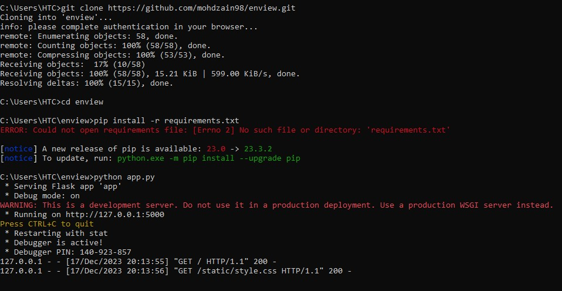

# Driver Monitoring System
## Prerequisites

- Python 3.x installed
- Flask library installed (you can install it using `pip install Flask`)

## Getting Started

1. Clone the repository:

   ```bash
   git clone https://github.com/mohdzain98/enview.git
   cd enview
2. Install Dependencies
   ```bash
   pip install -r requirement.txt
3. Run the flask application
   ```bash
   python app.py
4. Open the web browser and go to <a href="http://127.0.0.1:5000/" target="_BLANK">http://localhost:5000/</a> to view the dashboard
   
Or in github Desktop clone the repository, open in VS code and run app.py
   
## Usage
<div>
  <ul>
  <li>The web application provides an Alerts Dashboard with search functionality.</li>
  <li>You can search for alerts using free text, vehicle number, and date range.</li>
  <li>Alerts are displayed in a box with details such as alert type, driver information, and the option to mark an alert as a false alarm</li>
</ul>
</div>

### Text Search <br>
Enter the text in Search box and press enter or Search button and it will display the result. <br>
### Enter Vehicle Number <br>
Enter the vehicle number and it will display the results.<br>
### Enter Date range <br>
It will display the data between the date ranges.
<br>
### Running App in CMD

